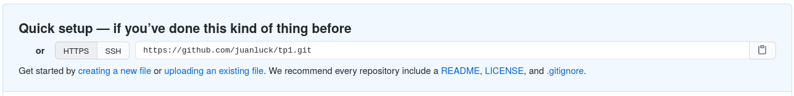

<a id='TP2'></a>
# TP 2 : Travailler en autonomie sur un depôt github distant 
[Retour à la page principale](../index.md)


Jusqu'à présent (dans le [TP1](../tp1/index.md)), nous avons travaillé sur un dépôt local. Cependant, le vrai pouvoir de git est de pouvoir travailler avec un dépôt distant (ou plateforme de gestion de projet, généralement hébergé sur un serveur externe), ce qui présente les avantages suivants: i) avoir une copie de sauvegarde du projet, ii) possibilité d'accéder au projet depuis différentes machines et iii) possibilité de travailler en équipe sur le même projet. 

Dans ce TP, nous allons travailler de manière autonome (il n'y a toujours pas de travail d'équipe) sur un référentiel distant. Vous connaissez sûrement déjà certaines de ces plateformes de gestion de projet : il en existe plusieurs. **Les plus connues :**

[Github](https://github.com) :
:	La plateforme la plus connue. Héberge gratuitement des projets. Souscriptions pour plus de fonctionalités. Le code est hébergé chez github.

[Bitbucket](https://bitbucket.org) : 
:    Similaire à GitHub. Programme étudiant (avec l’email universitaire). Le code est hébergé par Atlasian.

[Gitlab](https://about.gitlab.com/) :
:    Similaire aux précédents dans sa version commerciale (Entreprise Edition). Une version open source (Community Edition) permet l’installation privée d’un serveur.

---

## Objectifs du TP 2

Le but de ce deuxième TP  est de commencer à travailler en autonomie (pas de travaille en équipe pour l'instant) avec un dépôt git distant. En particulier, nous travaillerons avec le système github. Dans ce TP, nous allons apprendre: 

>1. [Créer un compte sur github](#github)
2. [Pousser un dépôt existant depuis la ligne de commande](#pushremote)
3. [Séquence de travail avec un dépôt distant](#sequence)
4. [Cloner un dépôt distant sur notre machine locale](#clone)
   


---

<a id='github'></a>
## 1. Créer un compte sur github 

Peut-être que certains d'entre vous avez déjà un compte github. Si tel est le cas, vous pouvez ignorer cette première étape. Sinon, créer un compte sur github est simple : 

1. Vous devez aller sur [github](https://github.com) et cliquer sur **sign up** pour vous insrire : 

2. Ensuite, vous devez remplir les champs suivants du formulaire. Prenez quelques minutes pour créer votre compte. 


-----

<a id='pushremote'></a>
## 2. Pousser un dépôt existant depuis la ligne de commande 

Jusqu'à présent, nous avons travaillé sur le dépôt git local `tp1`, il est temps de sauvegarder ce dépôt sur github. Pour ce faire, nous allons suivre une description qui montre comment le faire étape par étape. Mais tout d'abord, il est pratique de faire une brève introduction de trois commandes dans git qui nous aideront à gérer notre répertoire distant à partir de notre répertoire local sur la ligne de commande. 

* `git remote` :
: cette commande sert à gérer (ajouter) des dépôts distants ("remotes"). En d'autres termes, nous utiliserons cette commande pour créer un lien entre notre dépôt local `tp1` et celui distant que nous allons créer dans github. 

* `git push` :
: cette commande permet de mettre à jour le dépôt distant (e.g. github) à partir de la dernière version validée (_commit)_ de notre dépôt local. 

* `git pull` :
: cette commande sert à mettre à jour notre dépot local à partir de la dernière version de notre dépôt distant. 

**Êtes-vous prêts ? Allons commencer à travailler avec github !!** La première tâche sera de sauvegarder une copie de notre répertoire local `tp1` sur github. 

* Allez jusqu'au répertoire tp1, de sorte que la commande `pwd` affiche le résultat suivant :

```shell
$:> pwd
/.../courseGIT/tp1 
```

* Sur le site Web de github, allez en haut à droite et cliquez sur **New repository** comme indiqué dans l'image :


* Dans le formulaire, tapez **tp1** sous **Repository name** et laissez le reste des champs vides (comme indiqué dans l'image). Vous pouvez choisir que votre dépôt `tp1` soit public ou privé. 


* Vous venez de créer un dépôt vide dont le lien `https://github.com/<votre_utilisateur>/tp1.git` sera affiché comme dans l'image ci-dessous. 



* Tapez dans la console la ligne suivante pour vérifier que votre dépôt local `tp1` n'est pas encore lié à un dépôt distant. La réponse de cette commande ne doit rien afficher. 

```shell
$:~/courseGIT/tp1> git remote -v
```

* Maintenant, nous allons lier notre dépôt local `tp1` au répertoire distant `https://github.com/<votre_utilisateur>/ tp1.git` pour ce faire, écrivez la commande suivante en remplaçant `<votre_utilisateur>` par votre utilisateur. 

```shell
$:~/courseGIT/tp1> git remote add origin https://github.com/<votre_utilisateur>/tp1.git
```
* Jusqu'à présent, nous n'avons pas examiné le concept de branche dans git, et nous n'entrerons pas dans le détail avant la prochaine séance. Cependant, il faut savoir que toutes les versions que nous sauvegardons avec les différentes _commits_ sont stockées dans une branche. Normalement cette branche s'appellera **master** ou **main**. Pour finir d'établir le lien entre le dépôt local et distant, nous aurons besoin de connaître le nom de cette branche. Pour ce faire, tapez la commande suivante : 

```shell
$:~/courseGIT/tp1> git branch
*master
```
* Il ne reste plus qu'à créer le lien de manière permanente et mettre à jour le référentiel distant. Pour ce faire, écrivons la commande suivante: 

```shell
$:~/courseGIT/tp1> git push -u origin master
```

* Alors que nous essayons d'écrire dans le dépôt distant, il nous sera demandé notre nom d'utilisateur et notre mot de passe github. Ecrivez-les.

```shell
Username for 'https://github.com': <votre_utilisateur>
Password for 'https://<votre_utilisateur>@github.com': 
Counting objects: 19, done.
Delta compression using up to 4 threads.
Compressing objects: 100% (14/14), done.
Writing objects: 100% (19/19), 2.11 KiB | 0 bytes/s, done.
Total 19 (delta 0), reused 0 (delta 0)
To https://github.com/juanluck/tp1.git
 * [new branch]      master -> master
Branch master set up to track remote branch master from origin.
```
* **Félicitations !!** les deux dépôts local et distant sont maintenant synchronisés. Allez sur le site de votre projet https://github.com/<votre_utilisateur>/tp1 et voir les résultats. **N'est-ce pas cool ?**


-----

<a id='sequence'></a>
## 2. Séquence de travail avec un dépôt distant 

Dans le [tp1](../tp1/index.md), nous avons vu comment établir une séquence de travail simple dans un répertoire local à l'aide de la séquence de commandes suivant : `git status` -> `git add fichier` -> `git commit -m "message"` -> `git status` -> `...`

Une fois que le lien entre notre dépôt local et distant a été établi, nous allons introduire les commandes `git pull` et` git push` dans cette séquence. 
 
1. Modification d'un fichier existant ou création d'un nouveau fichier.
2. `git status` pour voir les fichiers à inclure dans le dépôt git.
3. `git add <fichier>` pour sélectioner le fichier (_stage_) que nous voulons suivre dans le dépôt git.
4. `git commit -m "Ajoutez ici un petit commentaire pour décrire ce commit"` pour valider/enregistrer les changements dans le dépôt git.
5. Enfin, la commande `git log` nous permet de voir toutes les différentes versions enregistrés dans notre dépôt.  Tapez `git log` pour voir le journal des différentes versions. Chaque entrée du log correspond à une version différent du fichier validée (_commit_). 


-----
<a id='clone'></a>
## 3. Cloner un dépôt distant sur notre machine locale 

```java
public class Cryptomonnaie{
    private String nom;
    private double valeurDeJeton ;

    public Cryptomonnaie(String nom, double valeurDeJeton){
        this.nom = nom;
        this.valeurDeJeton = valeurDeJeton;
    }

    public String getNom() {
        return nom;
    }

    public double getValeurDeJeton() {
        return valeurDeJeton;
    }

    @Override
    public String toString() {
        return nom+":"+valeurDeJeton;
    }
}
```